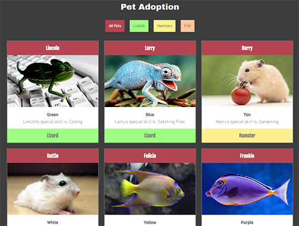
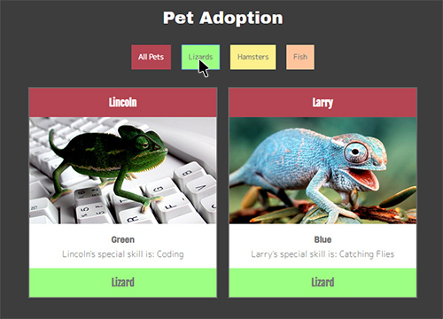

# NSS E12 Exercise - Pet Adoption Site

## Description:
The objective of this exercise was to create a pet adoption site using HTML, CSS, and JavaScript. This is the first exercise using JavaScript to print to the dom. I looped over an array of pets and printed them to the dom. This is also the first exercise using JavaScript event listeners. There are buttons on the top of the page that filter the cards shown by pet type. 

## Screenshots:
##### Main View:

##### Filtered View:

## How To Run:
>1. Clone down this repo.
>1. Install [http-server](https://www.npmjs.com/package/http-server).
>1. Navigate to folder in command line and type `http-server -p 8080`.
>1. Go to `http://localhost:8080` in your browser.
